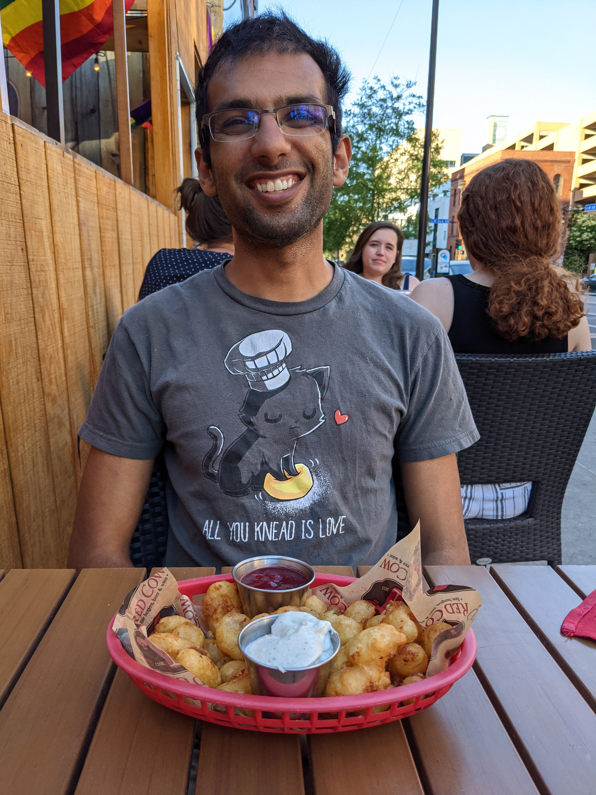

# About Me

Hi! My name is Shishir; I also go by Sunny. I am a human being. 

I'm currently employed as a postdoctoral [mathematician](math) at UC San Diego. I work and live on lands stewarded since time immemorial by the [Kumeyaay people](https://en.wikipedia.org/wiki/Kumeyaay). 

Besides math, other things I like doing include: doodling, reading, cooking, backpacking, studying language(s), and hanging out with my husband and my cat. 

When linguistically relevant, I'm comfortable with the use of either masculine or generic [grammatical gender](https://en.wikipedia.org/wiki/Grammatical_gender) in references to me (en: he or they pronouns, hi-ur: -ā inflections, ...). 

You can get in touch with me via [email](https://useplaintext.email/) at:

*  
*  [[PGP](pgp.asc)] 

# About the Website

Something on this website was last updated on {{ site.time | date: "%B %-d, %Y" }}. Software used in its making includes: [Jekyll](https://jekyllrb.com/) (including [jekyll-pandoc](https://github.com/mfenner/jekyll-pandoc) and [jekyll-redirect-from](https://github.com/jekyll/jekyll-redirect-from)), [Inkscape](https://inkscape.org/), [$\KaTeX$](https://katex.org/), [Ubuntu](https://ubuntu.com/), and many other things I should probably mention... 
