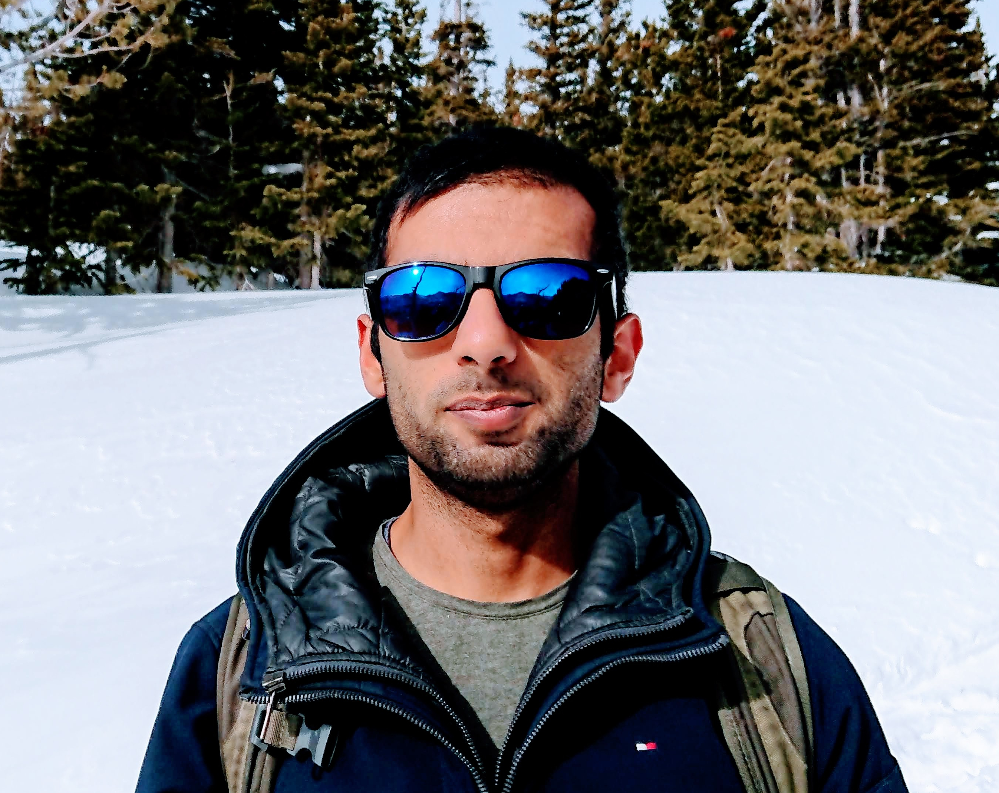

# About me

Hi there! My name is Shishir; I also go by Sunny. I am a human being. You can get in touch with me via email:

 [[PGP](pgp.txt)]

I am employed as a mathematician at [Colorado College](https://www.coloradocollege.edu/). I study [algebraic geometry](math/). 

Other things besides math that I like doing include: doodling, reading, cooking, hiking, learning about language(s), etc. I also organize a [Hindi-Urdu "reading club" of sorts](mehfil) at CC. 

# About the website

This website was last updated on {{ site.time | date: "%B %-d, %Y" }}. The list of software that was used in its making includes: [Jekyll](https://jekyllrb.com/) (including [Jekyll Scholar](https://github.com/inukshuk/jekyll-scholar) and [Jekyll Pandoc](https://github.com/mfenner/jekyll-pandoc)), [Inkscape](https://inkscape.org/), [KaTeX](https://katex.org/), [Ubuntu](https://ubuntu.com/), ... 
