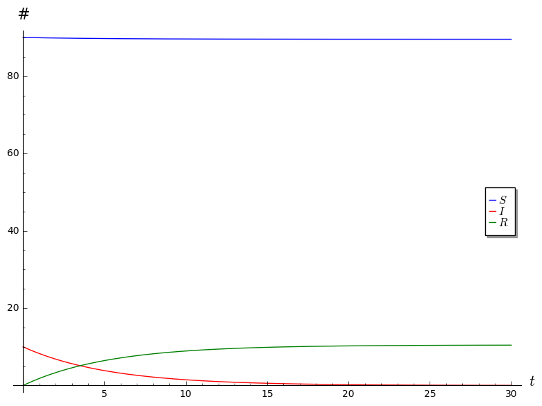

# SIR Project Comments

* Part I
    * Question 2. I was looking for the observation that b and c are both forced to be between 0 and 1, together with some justification of this.

    * Question 3. I was looking for something along the lines of the following: Since $S + I + R = N$ is constant, we have $S' + I' + R' = 0$, which means that $I' = - S' - R'$.

    * Question 5. All of you said that $S \to 0$ as $t \to \infty$. That's fine, and I didn't take off points for this, but this is not quite true: all that we know is that $S$ must stabilize at some value between 0 and $N$, but there is no guarantee that that value be 0. This will happen when the disease is not very virulent: recovery happens quickly (ie,$c$ is large), and the disease speads slowly (ie, $b$ is small). Here is a picture of this kind of situation. In this plot, we have $c = 0.2$, $b = 0.0001$, $R(0) = 0$, and $I(0) = 10$.
        

        If we let $S_\infty = \lim S(t)$, then what we know is that $R \to N - S_\infty$ and $I \to 0$ as $t \to \infty$, because every infected person will eventually recover.

    * Question 6. I was looking for something along the following lines: Observe that \[ \frac{dI}{dt} = bSI - cI = b\left(S - \frac{c}{b} \right)I. \] We know that $b \geq 0$. If $S(0) < c/b$, since $S$ is monotonically decreasing, we know that $S(t) < c/b$ for all $t$. Thus $S - c/b < 0$, so $dI/dt < 0$, which means that $I$ is monotonically decreasing.

    This analysis also tells us that, even if $S(0) > c/b$, we know as soon as $S(t) < c/b$, the infected population will start decreasing. 
