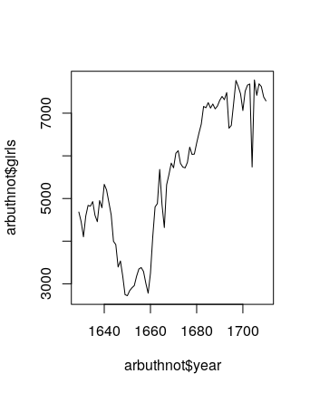
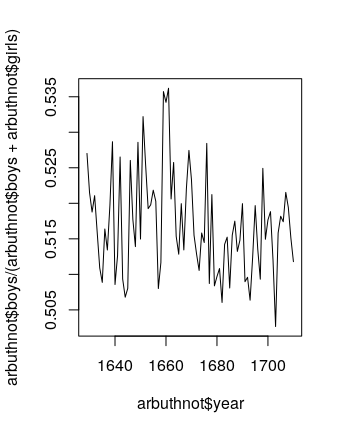
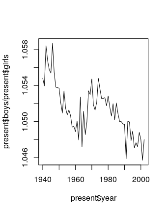
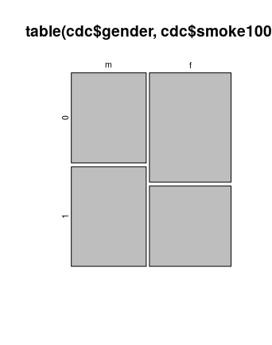
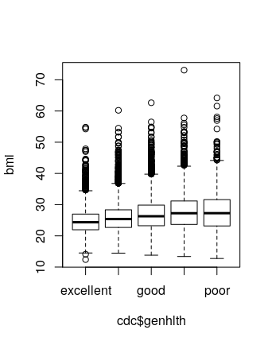
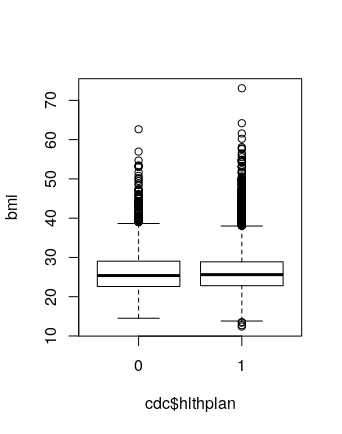
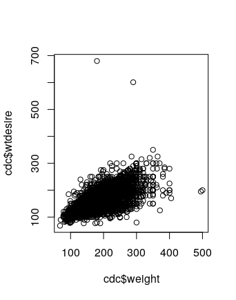
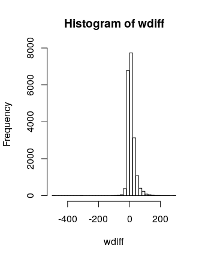
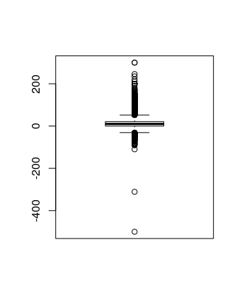
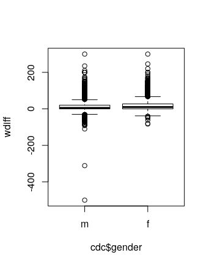

# Lab 1

## Exercises

1. `arbuthnot$girls`
2. It looks like there's a generally upwards trend. 

	
3. We generate the plot using the following command. 
 
	~~~R
	plot(arbuthnot$year, arbuthnot$boys / (arbuthnot$boys +  arbuthnot$girls), type = "l")	
	~~~

	The result is the following. It looks like it fluctuates a lot, but always stays solidly above 0.5. 
	
	

## On Your Own

1. The data is from years 1940-2002. There are 63 rows and 3 columns; the column names are "year," "boys," and "girls."
2. The data is on a similar scale: Arbuthnot's data ran for 82 years, while this data runs for 63. 
3. There's a generally decreasing trend in the ratio, but it stays above 1. 
	
	
4. The largest number of total births happened in 1961. 

	To figure this out in R, we note that 
	
	~~~R
	which.max(present$boys + present$girls)
	~~~
	returns the index of the largest entry of the vector `present$boys + present$girls`, which happens to be 22. Then, running 

	~~~R
	present[22,1]
	~~~
	then returns the entry in row 22 and column 1 (ie, the year corresponding to index 22), which happens to be 1961. 

	We can also put all of this together; the command
	
	~~~R
	present[which.max(present$boys + present$girls), 1]
	~~~
	returns the answer 1961 in just one line. 

# Lab 2

## Exercises

1. There are 20000 cases and 9 variables. `genhlth` is categorical (ordinal), `exerany`, `hlthplan`, `smoke100`, and `gender` are categorical (non-ordinal), `height`, `weight`, and `wtdesire` are numerical (continuous), and finally, `age` is numerical (discrete). 

2. For `height` and `age`, we get the following numerical summaries, and the interquartile ranges are 6 and 26, respectively. 
	
	~~~R
    > summary(cdc$height)
       Min. 1st Qu.  Median    Mean 3rd Qu.    Max. 
      48.00   64.00   67.00   67.18   70.00   93.00 
	> summary(cdc$age)
	   Min. 1st Qu.  Median    Mean 3rd Qu.    Max. 
	  18.00   31.00   43.00   45.07   57.00   99.00
	~~~

	For `gender` and `exerany`, we have the following relative frequency distributions. 

	~~~R
	> table(cdc$gender)/20000

		  m       f 
	0.47845 0.52155
	> table(cdc$exerany)/20000

		 0      1 
	0.2543 0.7457 
	~~~

	There are 9569 males in the sample, and 23.285% of the sample population reports being in excellent health. 

3. The mosaic plot (below) shows that relatively more men report having smoked 100 cigarettes than women. 

	

4. `under23_and_smoke <- subset(cdc, age < 23 & smoke100 == "1")`

5. The box plot of `genhlth` against `bmi` shows that decreasing health appears to coincide with higher BMIs. 

	

	Here is a box plot of `hlthplan` against `bmi`. It appears that having a health plan is correlated with fewer extreme BMIs. 

	

## On Your Own

1. The scatterplot shows a generally positive trend, but the slope appears to be less than 1. 

	

2. `wdiff <- cdc$weight - cdc$wtdesire` (but could do it the other way around too, which will affect answers below). 

3. `wdiff` is a vector of continuous numerical observations. An entry of 0 means that person is at their desired weight. An positive entry indicates the person wants to lose weight, and a negative entry indicates they want to gain weight.

4. Running `hist(wdiff,breaks=50)` and `boxplot(wdiff)` yield the following plots. 

	 

	It appears that most people are happy with their weights, but there is more of a skew towards the positive side (ie, more people want to lose weight than gain). 

5. Here are numerical summaries. 

	~~~R
	> cdc$wdiff <- wdiff
	> male <- subset(cdc, gender=="m")
	> female <- subset(cdc, gender=="f")
	> summary(male$wdiff)
	   Min. 1st Qu.  Median    Mean 3rd Qu.    Max. 
	-500.00    0.00    5.00   10.71   20.00  300.00 
	> summary(female$wdiff)
	   Min. 1st Qu.  Median    Mean 3rd Qu.    Max. 
	 -83.00    0.00   10.00   18.15   27.00  300.00 
	~~~

	And here is a side-by-side box plot.

	

	It appears that women generally want to lose more weight (comparing mean and/or medians). 

6. It appears that 70.76% of the weights are within one standard deviation of the mean. 

	~~~R
	> m <- mean(cdc$weight)
	> s <- sd(cdc$weight)
	> within_one_sd <- subset(cdc, weight > m-s & weight < m+s)
	> dim(within_one_sd)
	[1] 14152    10
	> 14152/20000
	[1] 0.7076
	~~~

