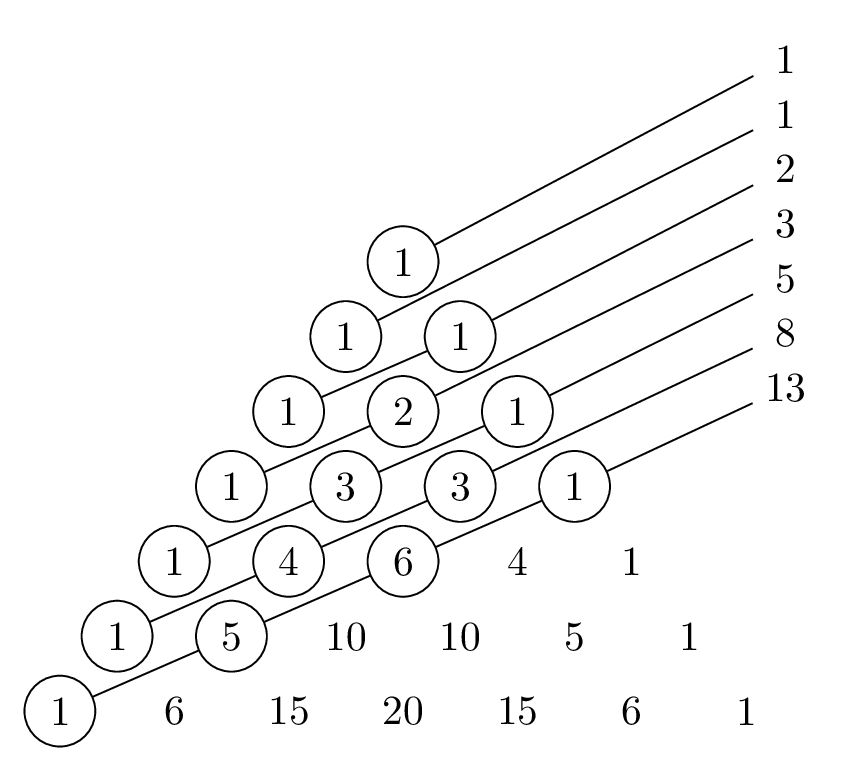

# Problem Sets

See instructions on the [syllabus](syllabus#problem-sets). Draft and final deadlines for each problem set are indicated on the [calendar](index#calendar). Submissions are all through Gradescope. 

There are two special types of problems: 

* Problems labelled "Challenging" might be harder than the others (or they might not be, and I just went about them in a harder-than-necessary way!). A thorough solution to these problems will earn you 1 additional point on top of whatever you would otherwise have gotten on that problem. 
* Problems labelled "programming" might require you to write some code. Feel free to write your code in whatever programming language you like. Note, though, that these problems will still require some mathematical forethought. In your TeX document, tell me the answer you got and write up a proof that your code works. Submit your TeX document through Gradescope as usual, and then email me a well-commented plaintext file containing the code you wrote (`.py`, `.sage`, `.R`, `.hs`, etc). 

## Problem Set A {#A}

1. Let $T$ be the set of equilateral triangles with integer side lengths. Let $T_1$ be the subset of $T$ consisting of triangles with even side lengths, and let $T_2$ be the subset of $T$ consisting of triangles with even perimeter. Is it true that $T_1 = T_2$? If so, prove it. If not, give an explicit example of a triangle that is in one of the sets but not the other. 

2. It is a fact that $(1+a)^n \geq 1+na$ for any real number $a \geq 0$ and any integer $n \geq 0$. Give two proofs of this fact: one using induction on $n$, and another using the binomial theorem. 

3. The Fibonnacci numbers $F_1, F_2, F_3, \dotsc$ are defined by declaring $F_1 = F_2 = 1$ and then recursively defining $F_{n+2} = F_{n+1} + F_n$. For example: 
$$ \begin{aligned} 
F_3 &= F_2 + F_1 = 1 + 1 = 2 \\
F_4 &= F_3 + F_2 = 2 + 1 = 3 \\
F_5 &= F_4 + F_3 = 3 + 2 = 5 \\
&\;\,\vdots
\end{aligned} $$
Prove that $F_1^2 + \dotsb + F_n^2 = F_nF_{n+1}$ for all $n \geq 1$. 

4. Suppose that the post office only issued 3-cent stamps and 7-cent stamps. Give an *explicit* description of the set of all postage amounts that can be created using stamps of these two types. Prove that your description is correct. 

    *Possible hint*. Start by working out some examples to see what amounts are possible. Is 1 cent possible? No. Is 2 cents possible? No. Keep going like this until you find a pattern, and then prove that your pattern holds forever. 

5. Prove that, for any integer $n \geq 1$, the binomial coefficient $\binom{2n}{n}$ is even.

    *Possible hint*. If it's possible to do this using induction, I don't know how. The argument I have in mind is not inductive. But if you're able to figure out an inductive argument, I'll be very happy to see it! 
    
6. (Programming, Challenging) A mysterious order of technomonks has developed an arcane alphabet with 13 letters. They believe that all of the names of God are enumerated by strings of lengths 1 through 13 in this alphabet, except those strings in which a single letter occurs more than 3 times in succession. When all of the names of God have been listed, they believe that the universe will blink out of existence. To bring about this eschatological end, they've written a computer program that will print out exactly one name of God every second. In how many years will the universe blink out of existence?[^clarke]

    [^clarke]: The premise of this problem is based loosely on Arthur C. Clarke's short story, "The Nine Billion Names of God." But, in this problem, there might not be nine billion names... ☺
    
7. (Challenging) Observe that the sums of the numbers in the diagonals of Pascal's triangle depicted below are Fibonacci numbers. 
    
    

      
    [[TeX Source](pascal-diagonals.tex)]
    

    Prove that this pattern continues forever. 

## Problem Set B {#B}

1. There are 63 piles of bananas with $n$ bananas each, and 7 additional bananas. All of these bananas are divided evenly among 23 travelers. How many bananas can be in each pile? (Describe the set of all possible values of $n$.)

    *Note*. This is a slight variant on a problem posed by the ninth-century mathematician [Mahāvīra](https://en.wikipedia.org/wiki/Mah%C4%81v%C4%ABra_(mathematician)). 

2. Prove that $n!+1$ and $(n+1)!+1$ are relatively prime for any integer $n \geq 1$. 

3. Prove that $$ \frac{\gcd(m,n)}{n} \binom{n}{m} $$ is an integer for all integers $n \geq m \geq 1$.

    *Possible hint*. Write $\gcd(m,n)$ as a linear combination of $m$ and $n$. 

4. Loki has acquired a well-earned reputation as a mischief-maker among the gods of Asgard. One day, Loki steals the goddess Iðunn's apples of eternal youth. With a wide grin on his face, he tells Iðunn that he's thinking of a perfect square which has remainder 3 when divided by 7, and if she tells him what number he's thinking of, he'll return her apples. Iðunn thinks about this for a few minutes, and then says "..." Loki glumly returns her apples. What did Iðunn say?

5. Define a sequence of integers recursively by declaring $S_1 = 1$, $S_2 = 2$, and $$ S_{n+2} = 2S_{n+1} + S_n $$ for all $n \geq 1$. How many divisions must the Euclidean algorithm perform when computing $\gcd(S_{n+1}, S_n)$ before it finds a remainder of 0? What is this gcd? How would your answers to these questions change if the initial conditions used to define the sequence were $S_1 = 14$ and $S_2 = 49$ instead?

6. Recall the definition of the triangular numbers $t_n$ from section 2.1, problem 1. Give an explicit description of the set of all positive integers $n$ such that $n \mid (t_1 + \dotsb + t_n)$. 

    *Possible hint*. You may find it helpful to use results you've proved on comprehension checks. If you do this, make sure to TeX up your proofs to these results as a part of your solution to this problem. 
    
7. (Programming) Qwmqwm is a mathematicalien. Whenever she chooses a favorite number $n$, her body reconfigures itself so that it has $T(n)$ tentacles, where $$ T(n) = \sum_{k = 1}^{n-1} \gcd(n+k,n-k). $$ Qwmqwm has just chosen her favorite number to be 7568640000000083, which happens to be prime. How many tentacles does she now have? 

8. Submit a solution to a problem from a previous problem set that you haven't gotten any points for so far. 

## Problem Set C {#C}

## Problem Set D {#D}

## Problem Set E {#E}
